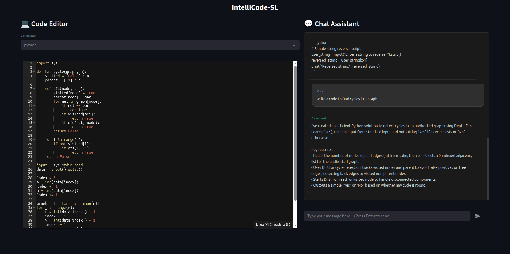

# IntelliCode-SL 💻🤖

**An AI-Powered Intelligent Code Assistant with Interactive IDE Interface**

[](https://www.python.org/)
[](https://streamlit.io/)
[](https://langchain-ai.github.io/langgraph/)
[](LICENSE)

> **BTech Final Year Project** - An intelligent coding assistant that combines the power of Large Language Models with an intuitive VS Code-like interface to help developers write, debug, explain, and document code seamlessly.

---

## 📋 Table of Contents

- [Overview](#-overview)
- [Key Features](#-key-features)
- [Architecture](#-architecture)
- [Technology Stack](#-technology-stack)
- [Installation](#-installation)
- [Usage](#-usage)
- [Project Structure](#-project-structure)
- [Workflow Details](#-workflow-details)
- [Screenshots](#-screenshots)
- [Future Enhancements](#-future-enhancements)
- [Contributing](#-contributing)
- [License](#-license)
- [Acknowledgments](#-acknowledgments)

---

## 🎯 Overview

**IntelliCode-SL** is an intelligent coding assistant designed to enhance developer productivity by providing real-time AI-powered assistance for various coding tasks. The system features a web-based IDE interface with an integrated chat assistant that can:

- **Explain** existing code with detailed breakdowns
- **Debug** code by identifying and fixing errors automatically
- **Write** new code from scratch based on natural language descriptions
- **Document** code with proper comments and documentation
- **Assist** with general coding queries and best practices

The project leverages **LangGraph** for orchestrating a multi-agent workflow and uses state-of-the-art language models through **OpenRouter API** to provide intelligent responses. The interface is built using **Streamlit** with a custom VS Code-inspired code editor.

---

## ✨ Key Features

### 🖥️ **Interactive IDE Interface**
- **Monaco Editor Integration** - VS Code's powerful editor with syntax highlighting
- **Multi-language Support** - Python, JavaScript, Java, C++, Go, Rust, TypeScript, and more
- **Real-time Code Statistics** - Line and character count display
- **Responsive Design** - Split-pane layout optimized for coding and chatting

### 🤖 **Intelligent AI Assistant**
- **Task Classification** - Automatically identifies user intent (explain/debug/write/docs/other)
- **Context-Aware Responses** - Considers both user prompt and existing code
- **Code Generation** - Generates clean, executable code from natural language
- **Bug Detection & Fixing** - Identifies and corrects errors automatically
- **Code Explanation** - Provides clear, point-wise explanations of code logic
- **Documentation Generation** - Creates comprehensive code documentation

### 💬 **ChatGPT-Style Interface**
- **Auto-scrolling Chat** - Always shows latest messages
- **Thinking Indicator** - Real-time feedback during processing
- **Message History** - Maintains conversation context
- **Instant Input Clearing** - Seamless user experience

### 🔄 **Multi-Agent Workflow**
- **LangGraph Orchestration** - State machine-based agent coordination
- **Conditional Routing** - Intelligent task routing based on classification
- **Modular Design** - Separate agents for different tasks
- **Collator Agent** - Synthesizes outputs into refined responses

---

## 🏗️ Architecture

IntelliCode-SL uses a **state-based multi-agent architecture** powered by LangGraph:

```
┌─────────────────────────────────────────────────────────────┐
│                      USER INTERFACE                         │
│  ┌──────────────────────┐     ┌──────────────────────┐    │
│  │   Code Editor (IDE)  │     │   Chat Assistant     │    │
│  │  - Monaco Editor     │     │  - Message History   │    │
│  │  - Syntax Highlight  │     │  - Input/Output      │    │
│  └──────────────────────┘     └──────────────────────┘    │
└─────────────────────────────────────────────────────────────┘
                            ↓
┌─────────────────────────────────────────────────────────────┐
│                    WORKFLOW ENGINE                          │
│                                                             │
│  START → Task Classifier → [Conditional Router]            │
│                                   ↓                         │
│              ┌────────────────────┼────────────────┐        │
│              ↓         ↓          ↓        ↓       ↓        │
│         Explain    Debug      Write    Docs   Unknown      │
│              ↓         ↓          ↓        ↓       ↓        │
│              └────────────────────┼────────────────┘        │
│                                   ↓                         │
│                            Collator Agent                   │
│                                   ↓                         │
│                                  END                        │
└─────────────────────────────────────────────────────────────┘
                            ↓
┌─────────────────────────────────────────────────────────────┐
│                    LLM BACKEND                              │
│  OpenRouter API → Grok-4.1-Fast Model                      │
└─────────────────────────────────────────────────────────────┘
```

### Workflow Components:

1. **Task Classifier** - Categorizes user requests into 5 types
2. **Explain Agent** - Provides code explanations
3. **Debug Agent** - Identifies and fixes bugs, generates summary
4. **Write Agent** - Generates new code, creates summary
5. **Docs Agent** - Creates documentation, generates summary
6. **Unknown Agent** - Handles uncategorized requests
7. **Collator Agent** - Synthesizes final user-friendly response

---

## 🛠️ Technology Stack

### **Frontend**
- **Streamlit** (1.51.0) - Web application framework
- **Streamlit-Ace** (0.1.1) - Monaco code editor component
- **HTML/CSS** - Custom styling for ChatGPT-like interface

### **Backend & AI**
- **LangGraph** (1.0.4) - Multi-agent workflow orchestration
- **LangChain** (1.1.0) - LLM application framework
- **OpenAI SDK** (2.8.1) - API client for OpenRouter
- **Python-dotenv** (1.2.1) - Environment variable management

### **LLM Provider**
- **OpenRouter API** - Access to Grok-4.1-Fast model
- **X.AI's Grok-4.1-Fast** - Primary language model

### **Development**
- **Python 3.11+** - Core programming language
- **Conda** - Environment management
- **Git** - Version control

---

## 🚀 Installation

### Prerequisites
- Python 3.11 or higher
- Conda (Anaconda/Miniconda)
- Git
- OpenRouter API key ([Get one here](https://openrouter.ai/))

### Step 1: Clone the Repository
```bash
git clone https://github.com/Spartan1-1-7/IntelliCode-SL.git
cd IntelliCode-SL
```

### Step 2: Create Conda Environment
```bash
conda create -n intellicode-sl python=3.11 -y
conda activate intellicode-sl
```

### Step 3: Install Dependencies
```bash
pip install -r requirements.txt
```

### Step 4: Configure API Key
Create a `.env` file in the project root:
```bash
echo "open_router_api=YOUR_API_KEY_HERE" > .env
```

Replace `YOUR_API_KEY_HERE` with your actual OpenRouter API key.

### Step 5: Run the Application
```bash
streamlit run main.py
```

The application will open in your default browser at `http://localhost:8501`

---

## 📖 Usage

### Basic Workflow

1. **Launch the Application**
   ```bash
   streamlit run main.py
   ```

2. **Write or Paste Code**
   - Use the left panel code editor
   - Select programming language from dropdown
   - Edit code with full VS Code features

3. **Interact with AI Assistant**
   - Type your request in the chat input
   - Press Enter to send
   - See "🤔 Thinking..." indicator while processing
   - View response and any code modifications

### Example Prompts

**Explain Code:**
```
Explain this sorting algorithm
```

**Debug Code:**
```
Find and fix the bugs in this code
```

**Write Code:**
```
Write a function to calculate factorial recursively
```

**Generate Documentation:**
```
Create comprehensive documentation for this class
```

**General Questions:**
```
What are the best practices for exception handling in Python?
```

---

## 📁 Project Structure

```
IntelliCode-SL/
│
├── main.py                    # Main Streamlit application
├── workflow.py                # LangGraph workflow definition
├── requirements.txt           # Python dependencies
├── .env                       # API keys (not in repo)
├── .gitignore                # Git ignore rules
│
├── styles/
│   ├── components.py         # UI component renderers
│   └── chat_styles.css       # Custom CSS styling
│
├── testing_files/
│   └── test.py               # Workflow testing scripts
│
└── README.md                 # This file
```

### Key Files

#### **main.py**
- Streamlit application entry point
- UI layout and session state management
- Integration between editor and workflow
- Real-time chat interface

#### **workflow.py**
- LangGraph state machine definition
- Multi-agent orchestration logic
- LLM prompt engineering
- Task routing and response synthesis

#### **styles/components.py**
- Reusable UI components
- Chat history rendering
- Code statistics overlay
- Custom button components

---

## 🔄 Workflow Details

### State Schema
```python
class intellicode_state(TypedDict):
    # User inputs
    prompt: str                    # User's natural language request
    input_code: Optional[str]      # Existing code in editor
    
    # Routing
    task_type: Literal['explain', 'debug', 'write', 'docs', 'other']
    
    # Processing
    change_summary: Optional[str]  # Point-wise summary of changes
    
    # Final outputs
    final_answer: str              # Response to user (shown in chat)
    modified_code: Optional[str]   # Updated code (shown in editor)
```

### Agent Functions

1. **task_classifier** - Categorizes user intent using structured output
2. **explain_slm** - Generates point-wise code explanations
3. **debug_code** - Fixes bugs and returns corrected code
4. **debug_summary** - Summarizes debugging changes
5. **write_code** - Generates new code from scratch
6. **write_summary** - Explains generated code
7. **docs_worker** - Creates documentation
8. **docs_summary** - Summarizes documentation
9. **collator** - Synthesizes refined user response
10. **unknown** - Handles edge cases and general queries

---

## 🖼️ Screenshots

### Main Interface


*VS Code-inspired IDE with integrated AI chat assistant*

---

## 🚧 Future Enhancements

### Planned Features
- [ ] **Multi-file Support** - Handle multiple files simultaneously
- [ ] **Code Execution** - Run code directly in the browser
- [ ] **Version Control Integration** - Git integration for code changes
- [ ] **Collaborative Editing** - Real-time multi-user support
- [ ] **Code Templates** - Pre-built templates for common patterns
- [ ] **Custom Model Selection** - Choose different LLMs
- [ ] **Offline Mode** - Local LLM support (Ollama integration)
- [ ] **Export Functionality** - Export chat history and code
- [ ] **Syntax Error Detection** - Real-time error highlighting
- [ ] **Code Formatting** - Auto-format with Black, Prettier, etc.
- [ ] **Testing Assistant** - Generate unit tests automatically
- [ ] **Performance Profiling** - Code optimization suggestions

### Research Directions
- **Fine-tuned Models** - Train specialized models for code tasks
- **RAG Integration** - Add codebase-specific context retrieval
- **Code Security Scanning** - Vulnerability detection
- **Multi-modal Support** - Diagram and flowchart generation

---

## 🤝 Contributing

Contributions are welcome! This is an academic project, but improvements and suggestions are appreciated.

### How to Contribute
1. Fork the repository
2. Create a feature branch (`git checkout -b feature/AmazingFeature`)
3. Commit your changes (`git commit -m 'Add some AmazingFeature'`)
4. Push to the branch (`git push origin feature/AmazingFeature`)
5. Open a Pull Request

### Development Guidelines
- Follow PEP 8 style guidelines for Python code
- Add docstrings to all functions
- Test changes thoroughly before submitting
- Update documentation for new features

---

## 📄 License

This project is licensed under the MIT License - see the [LICENSE](LICENSE) file for details.

---

## 🙏 Acknowledgments

### Project Team
- **BTech Computer Science Engineering**
- **Final Year Project 2025**
- **Institution:** CSE-Department, FOET, University of Lucknow

### Technologies & Libraries
- [Streamlit](https://streamlit.io/) - Web framework
- [LangGraph](https://langchain-ai.github.io/langgraph/) - Agent orchestration
- [LangChain](https://python.langchain.com/) - LLM framework
- [OpenRouter](https://openrouter.ai/) - LLM API provider
- [X.AI Grok](https://x.ai/) - Language model
- [Monaco Editor](https://microsoft.github.io/monaco-editor/) - Code editor

### Inspiration
- ChatGPT's conversational interface
- GitHub Copilot's code assistance
- VS Code's editor experience
- Cursor AI's code editing features

---

## 📞 Contact

**Project Repository:** [https://github.com/Spartan1-1-7/IntelliCode-SL](https://github.com/Spartan1-1-7/IntelliCode-SL)

**Issues & Bugs:** [GitHub Issues](https://github.com/Spartan1-1-7/IntelliCode-SL/issues)

---
<!-- 
## 📊 Project Statistics

- **Lines of Code:** ~1,000+
- **Languages:** Python, HTML, CSS, JavaScript
- **Development Time:** 4 months
- **Agent Count:** 10 specialized agents
- **Supported Languages:** 8 programming languages

--- -->

<div align="center">

**Built with ❤️ for developers by developers**

⭐ Star this repo if you find it helpful!

</div>