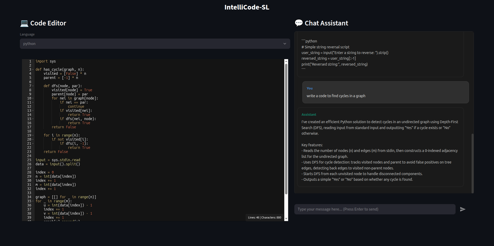

# IntelliCode-SL 💻🤖

**An AI-Powered Intelligent Code Assistant with Interactive IDE Interface**

[](https://www.python.org/)
[](https://streamlit.io/)
[](https://langchain-ai.github.io/langgraph/)
[](LICENSE)

> **BTech Final Year Project** - An intelligent coding assistant that combines local fine-tuned models, Groq fallback, and a VS Code-like interface to help developers write, debug, explain, modify, and document code seamlessly.

---

## 📋 Table of Contents

- [Overview](#-overview)
- [Key Features](#-key-features)
- [Architecture](#-architecture)
- [Technology Stack](#-technology-stack)
- [Installation](#-installation)
- [Usage](#-usage)
- [Project Structure](#-project-structure)
- [Workflow Details](#-workflow-details)
- [Screenshots](#-screenshots)
- [Future Enhancements](#-future-enhancements)
- [Contributing](#-contributing)
- [License](#-license)
- [Acknowledgments](#-acknowledgments)

---

## 🎯 Overview

**IntelliCode-SL** is a Streamlit-based coding assistant with a VS Code-style editor on the left and a chat assistant on the right. The app accepts a natural-language prompt plus optional editor code, routes the request through a LangGraph workflow, and returns one of the following outcomes:

- explain existing code
- debug or modify code
- generate new code from scratch
- generate documentation text
- handle uncategorized prompts through an interrupt/approval path

The runtime now uses local fine-tuned SLMs for classification and task execution, with Groq used as the fallback path when a local model fails. The editor is powered by `streamlit-ace` and supports Python, JavaScript, Java, C++, C, Go, Rust, and TypeScript.

---

## ✨ Key Features

### 🖥️ **Interactive IDE Interface**
- VS Code-style editor with syntax highlighting and keyboard shortcuts
- Multi-language support for the main languages used in the project
- Real-time code statistics for line and character counts
- Split-pane layout optimized for coding and chatting

### 🤖 **Intelligent AI Assistant**
- Task classification into `explain`, `debug`, `modify`, `write`, `docs`, or `other`
- Context-aware responses that consider both the prompt and editor code
- Code generation and code editing flows for common coding tasks
- Bug fixing and code explanation in concise, user-friendly output
- Documentation generation for comments and descriptive text

### 💬 **Chat-Style Interface**
- Persistent conversation history
- Thinking and resuming indicators while the workflow runs
- Enter-to-send chat input
- Clean code replacement when the workflow returns modified code

### 🔄 **Multi-Model Workflow**
- LangGraph orchestration for conditional routing
- Local SLMs for classifier, coding, docs, and formatter tasks
- Groq fallback for robustness when a local model returns empty output
- Interrupt-driven approval flow for uncategorized requests

---

## 🏗️ Architecture

IntelliCode-SL uses a state-based workflow that keeps the UI thin and pushes task decisions into `workflow.py`.


### Workflow Components

1. **Task Classifier** - Categorizes user requests into the active routing labels used by the graph.
2. **Explain Agent** - Produces point-wise code explanations.
3. **Debug Agent** - Returns corrected code and a summary of the fix.
4. **Modify Agent** - Applies requested edits and keeps the rest of the file intact.
5. **Write Agent** - Generates new code from scratch.
6. **Docs Agent** - Creates documentation or descriptive text.
7. **Unknown Agent** - Handles uncategorized requests through approval.
8. **Collator Agent** - Synthesizes the raw output into the final chat response.

---

## 🛠️ Technology Stack

### **Frontend**
- **Streamlit** (1.51.0) - Web application framework
- **Streamlit-Ace** (0.1.1) - Monaco-style code editor component
- **HTML/CSS** - Custom styling for the chat and editor layout

### **Backend & Workflow**
- **LangGraph** (1.0.4) - Graph-based workflow orchestration
- **LangChain** (1.1.0) - LLM application framework
- **LangChain-Groq** - Groq integration for fallback inference
- **Python-dotenv** (1.2.1) - Environment variable management

### **LLM / SLM Layer**
- **Local classifier model** - merged fp16 checkpoint
- **Local formatter model** - merged fp16 checkpoint
- **Coding SLM** - 4-bit base model plus adapter
- **Docs / explain SLM** - 4-bit base model plus adapter
- **Groq** - Fallback runtime when local inference is unavailable

### **Development**
- **Python 3.11+** - Core programming language
- **Conda** - Environment management
- **Git** - Version control

---

## 🚀 Installation

### Prerequisites
- Python 3.11 or higher
- Conda (Anaconda/Miniconda)
- Git
- A Groq API key for fallback inference
- Optional: Hugging Face token if you need to restore private local artifacts

### Step 1: Clone the Repository
```bash
git clone https://github.com/Spartan1-1-7/IntelliCode-SL.git
cd IntelliCode-SL
```

### Step 2: Create Conda Environment
```bash
conda create -n intellicode-sl python=3.11 -y
conda activate intellicode-sl
```

### Step 3: Install Dependencies
```bash
pip install -r requirements.txt
```

### Step 4: Configure API Key
Create a `.env` file in the project root:
```bash
groq_api_key=YOUR_GROQ_API_KEY
```

You can also set `GROQ_API_KEY` instead. If you need to restore gated Hugging Face artifacts, add `HF_TOKEN` as well.

### Step 5: Run the Application
```bash
streamlit run main.py
```

The application opens in your default browser at `http://localhost:8501`.

---

## 📖 Usage

### Basic Workflow

1. **Launch the Application**
	```bash
	streamlit run main.py
	```

2. **Write or Paste Code**
	- Use the left panel code editor
	- Select the programming language from the dropdown
	- Edit code with a VS Code-like experience

3. **Interact with the AI Assistant**
	- Type your request in the chat input
	- Press Enter or click send
	- See the thinking indicator while processing
	- View the response and any code modifications

### Example Prompts

**Explain Code:**
```text
Explain this sorting algorithm
```

**Debug Code:**
```text
Find and fix the bugs in this code
```

**Modify Code:**
```text
Refactor this function to use early returns
```

**Write Code:**
```text
Write a function to calculate factorial recursively
```

**Generate Documentation:**
```text
Create comprehensive documentation for this class
```

**General Questions:**
```text
What are the best practices for exception handling in Python?
```

---

## 📁 Project Structure

```text
IntelliCode-SL/
│
├── main.py                    # Streamlit application entry point
├── workflow.py                # LangGraph workflow definition
├── model_loader.py            # Local model loading and inference
├── requirements.txt           # Python dependencies
├── README.md                  # Project documentation
├── README_STREAMLIT.md        # Older Streamlit reference
├── context.md                 # Canonical repo context
│
├── styles/
│   ├── components.py          # UI component renderers
│   ├── chat_styles.css        # Custom CSS styling
│   ├── image.png              # Screenshot used in the README
│   └── send_button.png        # Send button asset
│
├── testing_files/
│   └── test.py                # Workflow testing scripts
│
├── scripts/
│   └── restore_hf_artifacts.py # Local artifact restore helper
│
├── adapters/                  # LoRA adapters and tokenizer assets
├── base_models/               # Local base model snapshots
├── merged_models/             # Local merged checkpoints
├── fine_tuning_notebooks /    # Training and comparison notebooks
└── fine_tunning_datasets/     # JSON datasets used for fine-tuning
```

The repository also includes benchmark results and other model assets that support local inference and evaluation.

---

## 🔄 Workflow Details

### State Schema
```python
class intellicode_state(TypedDict):
	 session_id: Optional[str]
	 prompt: str
	 input_code: Optional[str]
	 messeges: list[dict[str, str]]
	 message_summary: Optional[str]
	 latest_code_iteration: Optional[str]
	 task_type: Literal['explain', 'modify', 'debug', 'write', 'docs', 'other']
	 task_output: Optional[str]
	 change_summary: Optional[str]
	 final_answer: Optional[str]
	 modified_code: Optional[str]
	 unknown_route: Optional[str]
```

### Execution Flow

1. `main.py` renders the editor, chat, and session state.
2. A user prompt is passed into `workflow.invoke(...)`.
3. `task_classifier` tries the local classifier model first.
4. If local classification fails, Groq is used as the fallback.
5. The selected task node generates the answer or code.
6. `collator` formats the final response for the chat panel.
7. If modified code is returned, the editor content is replaced.
8. If the prompt is uncategorized, the approval flow is triggered.

### Agent Functions

1. **task_classifier** - Categorizes the user request.
2. **explain_slm** - Generates point-wise explanations.
3. **debug_code** - Fixes bugs and returns corrected code.
4. **debug_summary** - Summarizes debugging changes.
5. **modify_code** - Applies requested edits to the code.
6. **modify_summary** - Summarizes the modifications.
7. **write_code** - Generates new code from scratch.
8. **write_summary** - Summarizes generated code.
9. **docs_worker** - Creates documentation or descriptive text.
10. **docs_summary** - Summarizes documentation output.
11. **collator** - Synthesizes the final response.
12. **unknown** - Handles approval-based fallback requests.

---

## 🖼️ Screenshots

### Main Interface


*VS Code-inspired IDE with integrated AI chat assistant*

---

## 🚧 Future Enhancements

### Planned Features
- [ ] **Multi-file Support** - Handle multiple files simultaneously
- [ ] **Code Execution** - Run code directly in the browser
- [ ] **Version Control Integration** - Git integration for code changes
- [ ] **Collaborative Editing** - Real-time multi-user support
- [ ] **Code Templates** - Pre-built templates for common patterns
- [ ] **Custom Model Selection** - Choose different LLMs or local models
- [ ] **Offline Mode** - Improve fully local inference paths
- [ ] **Export Functionality** - Export chat history and code
- [ ] **Syntax Error Detection** - Real-time error highlighting
- [ ] **Code Formatting** - Auto-format with Black, Prettier, etc.
- [ ] **Testing Assistant** - Generate unit tests automatically
- [ ] **Performance Profiling** - Code optimization suggestions

### Research Directions
- **Fine-tuned Models** - Train more specialized models for code tasks
- **RAG Integration** - Add codebase-specific context retrieval
- **Code Security Scanning** - Vulnerability detection
- **Multi-modal Support** - Diagram and flowchart generation

---

## 🤝 Contributing

Contributions are welcome. This is an academic project, but improvements and suggestions are appreciated.

### How to Contribute
1. Fork the repository
2. Create a feature branch (`git checkout -b feature/AmazingFeature`)
3. Commit your changes (`git commit -m 'Add some AmazingFeature'`)
4. Push to the branch (`git push origin feature/AmazingFeature`)
5. Open a Pull Request

### Development Guidelines
- Follow PEP 8 style guidelines for Python code
- Add docstrings to functions where needed
- Test changes thoroughly before submitting
- Update documentation for new behavior

---

## 📄 License

This project is licensed under the MIT License - see the [LICENSE](LICENSE) file for details.

---

## 🙏 Acknowledgments

### Project Team
- **BTech Computer Science Engineering**
- **Final Year Project 2025**
- **Institution:** CSE-Department, FOET, University of Lucknow

### Technologies & Libraries
- [Streamlit](https://streamlit.io/) - Web framework
- [LangGraph](https://langchain-ai.github.io/langgraph/) - Workflow orchestration
- [LangChain](https://python.langchain.com/) - LLM framework
- [Groq](https://groq.com/) - Fallback LLM provider
- [Monaco Editor](https://microsoft.github.io/monaco-editor/) - Code editor inspiration

### Inspiration
- ChatGPT's conversational interface
- GitHub Copilot's code assistance
- VS Code's editor experience
- Cursor AI's code editing features

---

## 📞 Contact

**Project Repository:** [https://github.com/Spartan1-1-7/IntelliCode-SL](https://github.com/Spartan1-1-7/IntelliCode-SL)

**Issues & Bugs:** [GitHub Issues](https://github.com/Spartan1-1-7/IntelliCode-SL/issues)

<div align="center">

**Built with ❤️ for developers by developers**

⭐ Star this repo if you find it helpful!

</div>